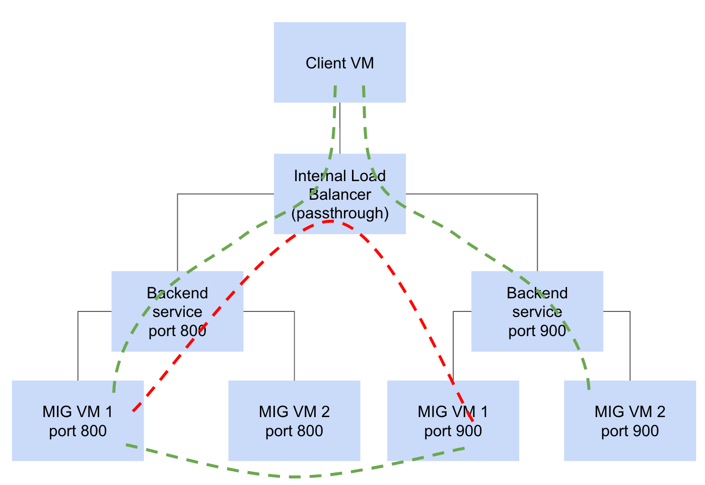

# tf-ilb

Using terraform, this repository creates a passtrough network ILB that serves two TCP ports (800, 900) on the same IP.

Note that, as described in the diagram:

* The client VM can connect to the ILB on either port, 800 or 900.
* The VMs for port 800 can connect **directly** to the VMs for port 900, and vice versa.

But:

* For some unknown routing issue. The VMs for port 800 **can not** connect to the VMs for port 900 **via the ILB** (red dotted line). If that is a requirement, this would not work for you.

